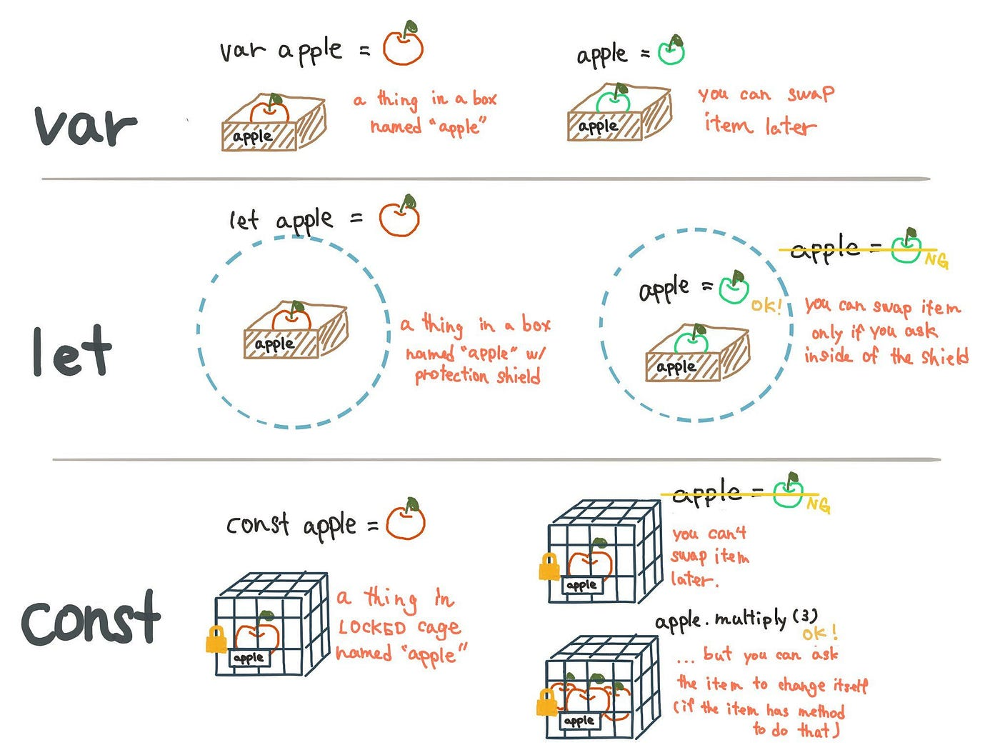
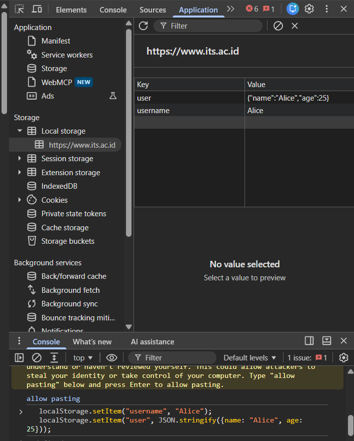
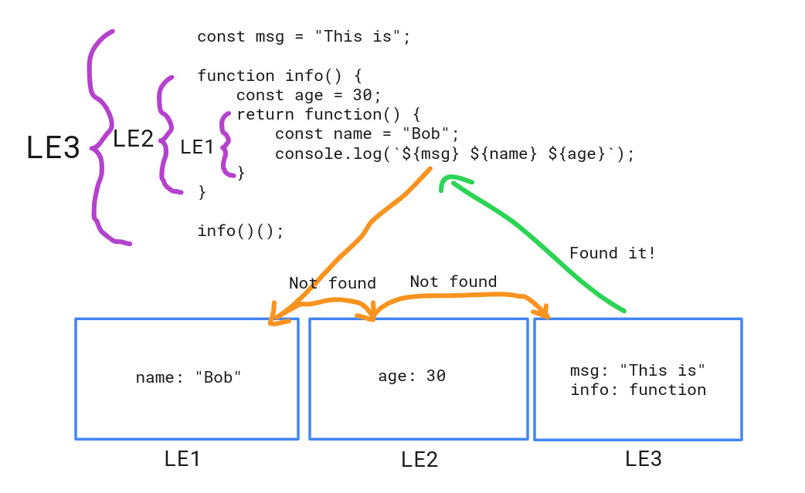

# Modul 2 - JavaScript

## 1. JavaScript Basics

JavaScript adalah bahasa pemrograman yang digunakan untuk menambahkan interaksi dan logika ke halaman web. JavaScript berjalan langsung di browser (client-side), tapi dengan Node.js, JavaScript juga bisa dijalankan di server (backend). Bahasa ini bersifat **dynamically typed** (tipe data tidak perlu dideklarasikan secara eksplisit) dan **interpreted** (dieksekusi baris per baris oleh engine JavaScript seperti V8 di Chrome).

Dalam modul ini, kalian akan mempelajari dasar-dasar JavaScript.

### 1.1. Menambahkan JavaScript ke HTML

Ada 3 cara utama menyisipkan JavaScript ke dalam halaman HTML:

- **Inline JavaScript**: Menggunakan atribut seperti `onclick`. Cara ini paling cepat tapi **tidak direkomendasikan** untuk proyek besar karena mencampur logika dengan markup, membuat kode sulit di-maintain.

```html
<button onclick="alert('Hello World!')">Click Me</button>
```

- **Internal JavaScript**: Menambahkan di dalam tag `<script>`, biasanya diletakkan sebelum penutup `</body>` agar tidak memblokir rendering HTML.

```html
<script>
  function greet() {
    alert("Hello, World!");
  }
</script>
```

- **External JavaScript**: Menghubungkan file eksternal. Ini adalah cara yang **paling disarankan** karena memisahkan logika (JS) dari struktur (HTML), lebih mudah di-cache oleh browser, dan lebih mudah dikelola dalam tim.

```html
<script src="./script.js"></script>
```

### 1.2. Sintaks Dasar

**Variabel**: Menggunakan `let` dan `const`. (kenapa nggada `var` mas?, karena rekom masa sekarang better `let` dan `const` yeah)

```js
let name = "Alice"; // variabel yang dapat diubah
const age = 25; // variabel konstan
```

Perbedaan singkat:

- `let` → nilainya bisa diubah (reassign) setelah dideklarasikan.
- `const` → nilainya tidak bisa diubah (untuk objek/array, isinya masih bisa diubah, tapi variabelnya tidak bisa di-assign ulang ke value lain).



#### Permasalahan Dengan `var`

Variabel yang dideklarasikan menggunakan `var` akan memiliki scope yang disebut sebagai **function scope**. Dalam JavaScript, hal ini berarti variabel tersebut masih bisa diakses di luar blok (`for`, `if`) yang menyebabkan bug lebih susah dilacak. Sebaliknya, `let` dan `const` memiliki **block scope**, artinya variabel hanya bisa diakses di dalam blok `{ }` tempat ia dideklarasikan.

Masalah lain dari `var` adalah **hoisting**: variabel `var` "diangkat" ke atas scope-nya dan otomatis bernilai `undefined` sebelum baris deklarasinya dijalankan, sehingga bisa menimbulkan bug yang membingungkan karena kode tetap berjalan tanpa error meskipun variabel dipakai sebelum didefinisikan.

Contoh:

```js
if (true) {
  var name = "Kelinci";
}
console.log(name); // "Kelinci" -> masih bisa diakses

if (true) {
  let newName = "Alice";
}
console.log(newName); // ❌ Error: newName is not defined
```

**Tipe Data**:

- **String** — teks, contoh: `"Hello"`
- **Number** — angka (integer maupun desimal), contoh: `10`, `3.14`
- **Boolean** — nilai benar/salah, `true` atau `false`
- **Null** — nilai yang sengaja dikosongkan/tidak ada
- **Undefined** — variabel yang sudah dideklarasikan tapi belum diberi nilai
- **Object** — kumpulan pasangan key-value
- **Array** — kumpulan data yang berurutan (list)

```js
let str = "Hello";
let num = 10;
let isTrue = true;
let nothing = null;
```

### 1.3. Fungsi

Fungsi adalah blok kode yang bisa dipanggil berulang kali untuk menjalankan tugas tertentu.

- **Mendefinisikan Fungsi** (function declaration) — bisa dipanggil bahkan sebelum baris deklarasinya karena mengalami hoisting penuh:

```js
function greet(name) {
  return `Hello, ${name}!`;
}
```

- **Fungsi Ekspresi** (function expression) — fungsi disimpan dalam variabel, tidak mengalami hoisting seperti function declaration:

```js
const greet = function (name) {
  return `Hello, ${name}!`;
};
```

- **Fungsi Panah** (arrow function) — sintaks lebih ringkas, dan **tidak memiliki `this` sendiri** (mengambil `this` dari scope di sekitarnya, disebut lexical `this`):

```js
const greet = (name) => `Hello, ${name}!`;
```

### 1.4. Pengkondisian

**If-Else**: digunakan untuk menjalankan blok kode berbeda berdasarkan suatu kondisi.

```js
let score = 85;

if (score > 90) {
  console.log("Excellent");
} else if (score > 70) {
  console.log("Good");
} else {
  console.log("Needs Improvement");
}
```

> 💡 **Tambahan**: Selain if-else, ada juga `switch` yang lebih rapi untuk banyak kondisi berdasarkan satu nilai, serta **ternary operator** untuk kondisi singkat: `const status = score > 70 ? "Lulus" : "Tidak Lulus";`

### 1.5. Looping

- **For Loop**: cocok saat kita tahu berapa kali perulangan akan dijalankan.

```js
for (let i = 0; i < 5; i++) {
  console.log(i);
}
```

- **While Loop**: cocok saat jumlah perulangan tidak diketahui pasti, bergantung pada kondisi.

```js
let count = 0;
while (count < 5) {
  console.log(count);
  count++;
}
```

> 💡 **Tambahan**: Ada juga `do...while` (kode dijalankan minimal 1 kali sebelum kondisi dicek), serta `for...of` (untuk iterasi array/iterable) dan `for...in` (untuk iterasi key pada objek).

### 1.6. Menggunakan Local Storage

Local Storage adalah penyimpanan di browser yang memungkinkan kalian menyimpan data secara permanen di sisi klien (hingga dihapus secara manual oleh pengguna). Data yang tersimpan di Local Storage bersifat **per-origin** (hanya bisa diakses dari domain yang sama) dan **hanya bisa menyimpan string** — objek/array harus di-convert dulu ke JSON string.

#### 1.6.1. Menyimpan Data ke Local Storage

Untuk menyimpan data ke local storage, gunakan metode `localStorage.setItem()`. Metode ini menerima dua parameter: kunci (key) dan nilai (value).

Contoh menyimpan data:

```js
localStorage.setItem("username", "Alice");

const user = {
  name: "Alice",
  age: 25,
};
localStorage.setItem("user", JSON.stringify(user));
```



#### 1.6.2. Mengambil Data dari Local Storage

Untuk mengambil data yang telah disimpan di local storage, gunakan metode `localStorage.getItem()`. Jika datanya adalah string yang di-encode sebagai JSON, gunakan `JSON.parse()` untuk mengubahnya kembali ke objek JavaScript.

Contoh mengambil data:

```js
const username = localStorage.getItem("username");
console.log(username); // Output: Alice

const user = JSON.parse(localStorage.getItem("user"));
console.log(user.name); // Output: Alice
```

#### 1.6.3. Menghapus Data dari Local Storage

Gunakan `localStorage.removeItem()` untuk menghapus item tertentu dari local storage.

Contoh menghapus data:

```js
localStorage.removeItem("username");
```

> `removeItem` tidak akan mengembalikan error apabila key yang dimasukkan tidak ditemukan.

Untuk menghapus semua data yang tersimpan di local storage, gunakan `localStorage.clear()`:

```js
localStorage.clear();
```

## 2. Intermediate JavaScript

Setelah memahami dasar-dasar JavaScript, kalian akan melanjutkan ke konsep yang lebih kompleks.

### 2.1. Arrays

Array digunakan untuk menyimpan kumpulan data dalam satu variabel, dan setiap elemennya bisa diakses melalui index (dimulai dari 0).

- **Mendefinisikan Array**:

```js
let fruits = ["🍏", "🍉", "🍊"]; // menyimpan beberapa nilai (buah) dalam satu variabel
```

- **Manipulasi Array** — `push` dan `pop` bekerja di akhir array (efisien, O(1)):

```js
fruits.push("🍇"); // Menambah elemen di akhir array
fruits.pop(); // Menghapus elemen terakhir
```

- **Menambah dan Menghapus Elemen di Awal Array** — `unshift` dan `shift` lebih lambat dibanding `push`/`pop` karena harus menggeser index semua elemen lainnya:

```js
fruits.unshift("🍊"); // Menambah elemen di awal array
fruits.shift(); // Menghapus elemen pertama
```

- **Menggabungkan Dua Array** — `concat` tidak mengubah array asli, melainkan mengembalikan array baru:

```js
const moreFruits = ["🍏", "🍉"];
const allFruits = fruits.concat(moreFruits);
```


- **Mengakses Elemen dengan `indexOf` dan `includes`**:

```js
const index = fruits.indexOf("🍏"); // Mengembalikan index dari '🍏', atau -1 jika tidak ditemukan
const hasApple = fruits.includes("🍏"); // Mengecek apakah array memiliki '🍏', hasilnya true/false
```

- **Menggunakan `slice` untuk Mengambil Subset** — `slice` **tidak mengubah** array asli:

```js
const someFruits = fruits.slice(1, 3); // Mengambil elemen dari index 1 hingga sebelum 3
```

- **Menggunakan `splice` untuk Menambah/Menghapus Elemen di Posisi Tertentu** — berbeda dengan `slice`, `splice` **mengubah langsung** array aslinya:

```js
fruits.splice(2, 0, "🍏"); // Menambah 🍏 di index 2 tanpa menghapus elemen
fruits.splice(1, 1); // Menghapus 1 elemen mulai dari index 1
```


- **Looping Melalui Array**:

```js
fruits.forEach((fruit) => {
  console.log(fruit);
});
```

### 2.2. Objects

Objek digunakan untuk menyimpan data dalam bentuk pasangan **key-value**, cocok untuk merepresentasikan entitas dengan banyak properti.

- **Mendefinisikan Objek**:

```js
let person = {
  name: "Alice",
  age: 25,
  greet: function () {
    return `Hello, ${this.name}`;
  },
};
let work = {
  name: "Lorem Ipsum",
  position: "Software Engineer",
  greet: () => {
    return `Hello, ${work.name}`;
  },
};
```

- **Akses Properti** — ada dua cara: dot notation dan bracket notation. Bracket notation berguna saat nama properti berupa variabel atau mengandung karakter khusus:

```js
console.log(person.name); // Mengakses dengan titik
console.log(person["age"]); // Mengakses dengan bracket
console.log(work.name); // Mengakses dengan titik
console.log(work["position"]); // Mengakses dengan bracket
console.log(work.greet()); // Memanggil method greet()
```

### 2.3. DOM Manipulation

DOM (Document Object Model) adalah representasi struktur halaman HTML dalam bentuk objek yang bisa diakses dan dimanipulasi lewat JavaScript, memungkinkan halaman web menjadi interaktif dan dinamis tanpa perlu reload.

#### 2.3.1. DOM Document

`document` adalah objek utama yang mewakili seluruh halaman web. Kalian bisa mengakses elemen, membuat elemen baru, dan melakukan manipulasi DOM lainnya menggunakan `document`.

Sebelum masuk ke kode, penting untuk memahami dulu **bagaimana DOM merepresentasikan sebuah dokumen HTML**. DOM menggambarkan struktur dokumen sebagai sebuah **tree (pohon)**, di mana setiap elemen HTML menjadi sebuah node yang saling terhubung secara hierarkis (parent-child).

Contoh dokumen HTML berikut:

```html
<html lang="en">
  <head>
    <title>My Document</title>
  </head>
  <body>
    <h1>Header</h1>
    <p>Paragraph</p>
  </body>
</html>
```

akan direpresentasikan sebagai DOM tree seperti ini:


_Sumber: [MDN Web Docs — Document Object Model (DOM)](https://developer.mozilla.org/en-US/docs/Web/API/Document_Object_Model), dilisensikan di bawah [Creative Commons Attribution-ShareAlike (CC-BY-SA)](https://developer.mozilla.org/docs/MDN/Writing_guidelines/Attrib_copyright_license)._

Dari gambar di atas, terlihat bahwa `<html>` menjadi node paling atas (root), lalu bercabang ke `<head>` dan `<body>`, dan seterusnya hingga ke node teks seperti "Header" dan "Paragraph". Struktur pohon inilah yang memungkinkan JavaScript menelusuri (traverse), membaca, dan mengubah bagian mana pun dari dokumen menggunakan `document`.


Contoh mengakses elemen:

```js
const title = document.getElementById("title");
const paragraphs = document.querySelectorAll("p");
```

> 💡 **Tambahan**: `getElementById` hanya mengambil 1 elemen dan lebih cepat karena mencari berdasarkan ID unik. `querySelector`/`querySelectorAll` lebih fleksibel karena menerima CSS selector apa pun (class, tag, atribut, dsb), tapi sedikit lebih lambat.

#### 2.3.2. DOM Elements

Elemen DOM bisa diakses dan dimanipulasi untuk mengubah konten, gaya, atribut, dll.

Contoh mengubah konten dan gaya:

```js
title.textContent = "New Title";
title.style.color = "blue";
```

> 💡 **Tambahan**: Gunakan `textContent` jika hanya ingin mengganti teks biasa (lebih aman), dan gunakan `innerHTML` hanya jika memang perlu menyisipkan markup HTML (lihat peringatan XSS di bagian selanjutnya).

#### 2.3.3. DOM HTML

`innerHTML` digunakan untuk mengubah atau menyisipkan konten HTML dalam elemen. (Awas kena XSS puhh)

Contoh:

```js
const content = document.getElementById("content");
content.innerHTML =
  "<h1>Judul Baru</h1><p>Paragraf diubah dengan innerHTML.</p>";
```

> ⚠️ **Kenapa berbahaya?** Jika string yang dimasukkan ke `innerHTML` berasal dari input pengguna (misalnya kolom komentar) dan tidak disaring, penyerang bisa menyisipkan tag `<script>` berisi kode jahat yang akan otomatis dieksekusi di browser korban — ini disebut serangan **XSS (Cross-Site Scripting)**. Solusi: gunakan `textContent` untuk teks biasa, atau sanitasi input dengan library seperti DOMPurify sebelum memasukkannya ke `innerHTML`.

#### 2.3.4. DOM Forms

Untuk mengakses dan memanipulasi elemen form seperti input, textarea, dll., kalian bisa menggunakan properti `value`.

Contoh menangani form:

```js
const form = document.getElementById("myForm");
form.addEventListener("submit", (event) => {
  event.preventDefault();
  const inputValue = document.getElementById("inputField").value;
  alert(`Input value: ${inputValue}`);
});
```

#### 2.3.5. DOM CSS

Untuk mengubah gaya elemen, kalian bisa menggunakan properti `style`.

Contoh:

```js
title.style.fontSize = "24px";
title.style.backgroundColor = "yellow";
```

#### 2.3.6. DOM Animations

Kalian bisa menambahkan animasi menggunakan CSS atau JavaScript. Dengan JavaScript, properti `style` bisa digunakan untuk mengubah transformasi dan transisi.

Contoh:

```js
const box = document.getElementById("box");
box.style.transition = "transform 0.5s";
box.style.transform = "rotate(45deg)";
```

#### 2.3.7. DOM Events

Event adalah tindakan yang dilakukan oleh pengguna atau browser seperti klik, scroll, dan input. Kalian bisa menggunakan event seperti `click`, `input`, atau `submit`.

Contoh event click yang digunakan di HTML nantinya:

```js
function changeText(id) {
  id.innerHTML = "Huft!";
}
```

#### 2.3.8. DOM Event Listener

`addEventListener` digunakan untuk menambahkan event listener ke elemen DOM. Ini adalah cara yang lebih disarankan dibanding atribut inline (`onclick`) karena memisahkan logika dari HTML dan bisa menambahkan lebih dari satu listener pada elemen yang sama.

Contoh menangani klik tombol:

```js
button.addEventListener("click", () => {
  console.log("Button was clicked!");
});
```

#### 2.3.9. DOM Nodes

Semua elemen di DOM adalah node, dan kalian bisa memanipulasinya dengan metode seperti `appendChild`, `removeChild`, atau `replaceChild`.

Contoh menghapus elemen:

```js
const parentElement = document.getElementById("parent");
const childElement = document.getElementById("child");
parentElement.removeChild(childElement);
```

#### 2.3.10. DOM Collections & Node List

`HTMLCollection` dan `NodeList` adalah koleksi elemen DOM. Kalian bisa melakukan iterasi di atas koleksi tersebut seperti pada array, meskipun tidak sepenuhnya sama.

Contoh dengan NodeList:

```js
const paragraphs = document.querySelectorAll("p");
paragraphs.forEach((p) => {
  p.style.color = "green";
});
```

Contoh dengan HTMLCollection:

```js
const divs = document.getElementsByTagName("div");
for (let i = 0; i < divs.length; i++) {
  divs[i].style.backgroundColor = "yellow";
}
```


## 3. Advanced JavaScript

Di bagian ini, kalian akan mempelajari fitur dan konsep lanjutan dalam JavaScript, terutama seputar penanganan operasi yang butuh waktu (asynchronous).

### 3.1. Asynchronous JavaScript

JavaScript bersifat **single-threaded** (hanya bisa menjalankan satu operasi dalam satu waktu), tapi bisa menangani operasi yang butuh waktu lama (seperti fetch data dari server) tanpa memblokir keseluruhan program berkat konsep asynchronous.

- **Callback** — cara paling lama untuk menangani async, tapi jika bersarang terlalu dalam bisa menyebabkan "callback hell" (kode sulit dibaca karena banyak nested function):

```js
function fetchData(callback) {
  setTimeout(() => {
    const data = {
      name: "Alice",
      age: 24,
      posistion: "Software Engineer",
    };
    callback(data);
  }, 2000);
}

function handleData(data) {
  console.log(data);
}

fetchData(handleData);
```

Fungsi `fetchData` menerima fungsi callback (`handleData`) sebagai argumen, yang kemudian dipanggil setelah `setTimeout` selesai dan data siap digunakan.

- **Promises** — solusi untuk mengatasi callback hell, merepresentasikan nilai yang akan tersedia di masa depan (bisa berhasil/`resolve` atau gagal/`reject`):

```js
const fetchData = new Promise((resolve, reject) => {
  setTimeout(() => {
    const data = { name: "Alice" };
    resolve(data);
  }, 2000);
});

fetchData.then((data) => console.log(data));
```

- **Async/Await** — sintaks lebih modern di atas Promise, membuat kode async terlihat seperti kode synchronous sehingga lebih mudah dibaca:

```js
async function fetchData() {
  const response = await fetch("https://api.example.com/data");
  const data = await response.json();
  console.log(data);
}

fetchData();
```


### 3.2. Error Handling

**Try-Catch**: digunakan untuk menangkap error yang mungkin terjadi saat eksekusi kode, agar program tidak langsung berhenti (crash) ketika terjadi error.

```js
try {
  // kode yang mungkin terjadi error
} catch (error) {
  console.error("Error occurred:", error);
}
```

### 3.3. Closures

Closure terjadi ketika sebuah fungsi "mengingat" variabel dari scope tempat ia dibuat, meskipun fungsi luar tersebut sudah selesai dieksekusi. Ini sangat berguna untuk menyembunyikan (encapsulate) data privat.

Konsep di balik closure adalah **lexical scope chain**: saat JavaScript mencari sebuah variabel, ia akan mencari dari scope paling dalam dulu, lalu naik terus ke scope yang lebih luar sampai variabelnya ketemu (atau sampai ke scope paling luar dan tetap tidak ketemu → error).

Contoh Closures:

```js
const msg = "This is";

function info() {
  const age = 30;
  return function () {
    const name = "Bob";
    console.log(`${msg} ${name} ${age}`);
  };
}

info()();
```



## 4. Expert JavaScript

Pada level ini, kalian akan diberikan topik-topik lanjutan dan praktik JavaScript.

### 4.1. Functional Programming

Functional Programming adalah gaya pemrograman yang mengutamakan fungsi murni (pure function) dan menghindari perubahan data secara langsung (mutasi).

- **Higher-Order Functions** — fungsi yang menerima fungsi lain sebagai argumen dan/atau mengembalikan fungsi:

```js
const add = (a) => (b) => a + b;
const add5 = add(5);
console.log(add5(10)); // Output: 15
```

- **Map, Filter, Reduce** — tiga method array yang sangat penting dalam functional programming, ketiganya **tidak mengubah array asli** (return array/nilai baru):

```js
const numbers = [1, 2, 3, 4, 5];
const doubled = numbers.map((num) => num * 2); // [2, 4, 6, 8, 10]
const evenNumbers = numbers.filter((num) => num % 2 === 0); // [2, 4]
const sum = numbers.reduce((acc, num) => acc + num, 0); // 1 + 2 + 3 + 4 + 5 = 15
```

Penjelasan singkat masing-masing:

- **`map`** — mengubah setiap elemen array menjadi bentuk baru, hasilnya array baru dengan jumlah elemen yang sama.
- **`filter`** — menyaring elemen array berdasarkan kondisi tertentu, hasilnya array baru yang isinya lebih sedikit atau sama.
- **`reduce`** — "meringkas" seluruh elemen array menjadi satu nilai tunggal (bisa angka, objek, array baru, dll), berdasarkan fungsi accumulator yang diberikan.

Contoh Visualisasi Method Array:


### 4.2. Event Delegation

Event Delegation adalah teknik memasang satu event listener pada elemen parent, alih-alih memasang listener di setiap elemen child satu per satu. Ini memanfaatkan konsep **event bubbling** (event yang terjadi pada child akan "menggelembung" ke parent-nya).

Menggunakan Event Delegation:

```js
document.querySelector("#parent").addEventListener("click", (event) => {
  if (event.target.matches("button")) {
    console.log("Button clicked:", event.target.textContent);
  }
});
```

Contoh Event Bubbling dalam Visual:


### 4.3. Best Practices

- Gunakan `let` dan `const` daripada `var` untuk mendeklarasikan variabel.
- Tulis kode yang bersih dan terorganisir dengan mengikuti prinsip **KISS** (_Keep It Simple, Stupid_).
- Gunakan linting tools seperti **ESLint** untuk menjaga konsistensi kode.
- **Tambahan**: Gunakan `===` (strict equality) daripada `==` (loose equality) untuk menghindari bug akibat konversi tipe data otomatis (type coercion) yang tidak disengaja.
- **Tambahan**: Hindari memodifikasi variabel global secara langsung; usahakan setiap fungsi bekerja dengan parameter dan return value yang jelas (mendekati konsep pure function).
- **Tambahan**: Beri nama variabel dan fungsi yang deskriptif (misalnya `calculateTotalPrice` daripada `calc` atau `x`) agar kode mudah dipahami tanpa perlu banyak komentar tambahan.
- **Tambahan**: Gunakan `console.log` secukupnya saat development, dan pastikan dihapus/dinonaktifkan sebelum kode di-deploy ke production.

## Challenge 1 (To-Do List Sederhana): 

buatlah aplikasi **To-Do List mini** menggunakan HTML dan JavaScript (boleh tanpa CSS khusus, styling seadanya juga ngga masalah).


### Requirement (wajib)

**1. Menambah Task**
- Sediakan input teks dan tombol "Add".
- Saat tombol diklik, tampilkan teks tersebut sebagai item baru di dalam list (`<ul>`).
- Input kosong tidak boleh ditambahkan (cukup cek dengan if sederhana).

**2. Menghapus Task**
- Setiap item punya tombol "Delete" di sampingnya.
- Saat diklik, item tersebut hilang dari list.

### Bonus (opsional)
- Klik teks task untuk mencoret (`line-through`) sebagai tanda "selesai".

### Ketentuan Teknis
- Gunakan `let`/`const`.
- Gunakan `addEventListener`, bukan `onclick` inline.

## Challenge 2 (Lanjutan To-Do List: Simpan & Filter):

Lanjutkan aplikasi **To-Do List** dari Challenge 1. Di challenge ini kalian cuma perlu nambahin 2 fitur simpel: biar task-nya **gak hilang pas di-refresh**, dan bisa **difilter**.


### Requirement (wajib)

**1. Simpan Task ke Local Storage**
- Task yang ditambahkan disimpan ke `localStorage` (pakai `setItem`, data array di-`JSON.stringify()` dulu).
- Saat halaman dibuka/refresh, ambil lagi task yang tersimpan (`getItem` + `JSON.parse()`) dan tampilkan seperti semula.
- Setiap ada tambah/hapus task, update juga data di `localStorage`.

**2. Filter Sederhana**
- Sediakan 2 tombol aja: **All** dan **Completed**.
- Klik "Completed" → tampilkan cuma task yang sudah ditandai selesai (pakai `Array.filter()`).
- Klik "All" → tampilkan semua task lagi.

### Bonus (opsional, boleh dilewati)
- Tambahin tombol "Active" (task yang belum selesai) sebagai filter ketiga.

### Ketentuan Teknis
- Gunakan `let`/`const`.
- Gunakan `addEventListener`.
- Data yang disimpan ke `localStorage` berbentuk array of object, jangan lupa `JSON.stringify()` / `JSON.parse()`.
